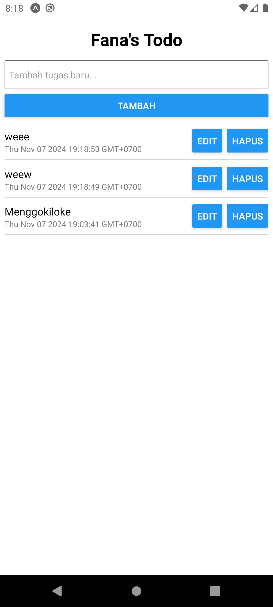
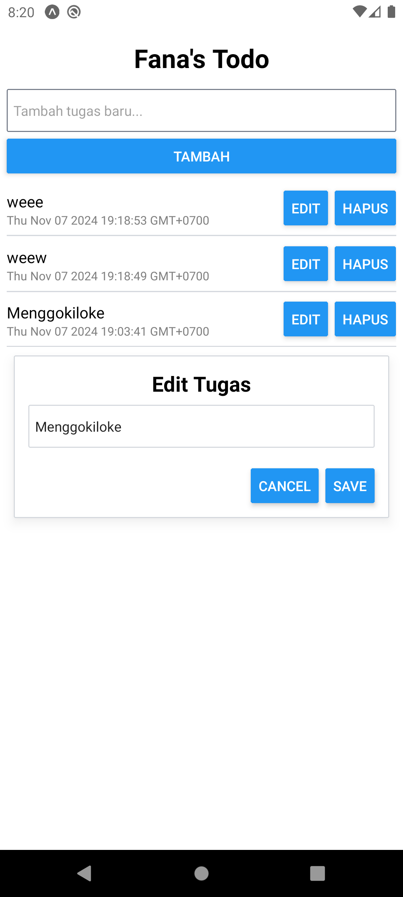
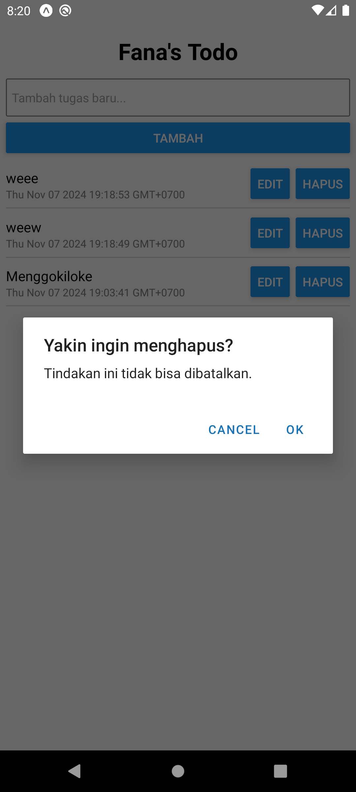

# Expo NativeWind Firebase To-Do App

This is a simple to-do list application built with [Expo](https://expo.dev/), [NativeWind](https://nativewind.dev/), and [Firebase](https://firebase.google.com/) Firestore. The app demonstrates how to set up a basic to-do list using Firebase for data storage and NativeWind for styling in a React Native environment.

## Features

- Add, update, and delete to-do items
- Persistent storage with Firebase Firestore
- Real-time updates for to-do items
- Styled with Tailwind CSS utility classes via NativeWind

## Tech Stack

- **Expo** - Development framework for building React Native apps.
- **NativeWind** - Tailwind CSS styling for React Native components.
- **Firebase Firestore** - Backend-as-a-service for storing and syncing data.

## Prerequisites

- [Node.js](https://nodejs.org/) and [npm](https://npm.io/) for package management.
- Expo CLI: Install via `npm install -g expo-cli`
- Firebase account and Firestore project set up.

## Setup Instructions

1. **Clone the Repository**

    ```bash
    git clone https://github.com/MasFana/ReactNative-Firebase-ToDo
    cd ReactNative-Firebase-ToDo
    ```

2. **Install Dependencies**

    ```bash
    npm install
    ```

3. **Configure Firebase**

   - Go to the [Firebase Console](https://console.firebase.google.com/) and create a new project.
   - In the Firestore database, create a collection named `todos`.
   - Copy your Firebase config object (from Project Settings) and add it to a firebase.js

    ```javascript
	const firebaseConfig = {
	    apiKey: "",
	    authDomain: "",
	    projectId: "",
	    storageBucket: "",
	    messagingSenderId: "",
	    appId: ""
	};
    ```

4. **Start the Project**

    ```bash
    npm start
    ```

   This will launch the Expo server, and you can run the app on an iOS/Android emulator or a real device using the Expo Go app.

## Project Structure

- **/components** - Reusable UI components
- **/screens** - App screens (e.g., Home, Add Todo)
- **/firebase** - Firebase configuration and Firestore interaction functions
- **App.js** - Entry point for the app, sets up navigation and global providers

## Usage

1. Add a new task by entering text and clicking the **Tambah** button.
2. Update or delete tasks by interacting with the options available in the to-do list.
3. The app syncs all changes with Firebase Firestore in real-time.

## Dependencies

- [expo](https://expo.dev/)
- [react-native](https://reactnative.dev/)
- [nativewind](https://nativewind.dev/)
- [firebase](https://firebase.google.com/docs/web/setup)
- [expo-env](https://docs.expo.dev/guides/environment-variables/)

## Screenshots

| Add Task | Edit Task | Delete Task |
|----------|-----------|-------------|
|  |  |  |
